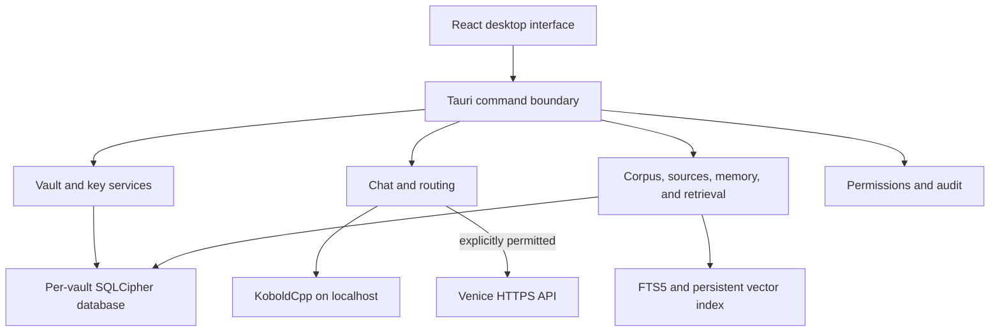

# Sammy

**A local-first, encryption-first personal AI consigliere for Windows.**

Sammy keeps the durable parts of an AI relationship — identity, knowledge,
sources, reviewed memory, conversations, permissions, and audit history —
inside owner-controlled encrypted vaults. The language model is a replaceable
provider, not the authoritative memory store.

> **Keep the soul. Change the brain.**

| Start here | Go deeper |
| --- | --- |
| [Quick start](docs/getting-started/quick-start.md) | [Architecture](docs/architecture/overview.md) |
| [**The Sammy Learner's Manual**](docs/README.md) | [Security model](docs/security/security-model.md) |
| [Interactive walkthrough](walkthrough-overview.html) | [Build from source](docs/development/setup.md) |
| [Glossary](docs/reference/glossary.md) | [FAQ](docs/FAQ.md) |

---

## Why Sammy exists

Traditional AI relationships are commonly tied to one model, vendor, chat
history, or cloud account. Changing providers can mean losing the context that
made the assistant useful.

Sammy separates the **replaceable brain** from persistent owner-controlled
knowledge. Sammy's encrypted **vault corpus** is internal to Sammy. The
**Personal Knowledge Corpus (PKC)** is a separate product; this client may
query it read-only when the feature gate is on. Canonical knowledge remains
independent of KoboldCpp, Venice, or any future provider. Derived search
indexes can be rebuilt from the vault corpus.

---

## What ships today

| Capability | Current behavior |
| --- | --- |
| Encrypted vaults | Independent SQLCipher databases with Argon2id-derived key wrapping, recovery codes, inactivity locking, and atomic manifests |
| Local AI | KoboldCpp-compatible model discovery and chat over a configurable localhost endpoint |
| Optional external PKC | Feature-gated read-only retrieval through the same authorized gateway as the PKC Reference Client. Default off. See [external PKC slice](docs/pkc-external-read-only.md) |
| Optional cloud AI | Venice transport with encrypted per-vault **API keys** ([what that means](docs/reference/glossary.md#api-and-api-key)), explicit routing, consent, and audited cloud crossing |
| Knowledge corpus | Typed records, provenance, contradictions, corrections, supersession, tombstones, and full-text search |
| Documents | TXT, Markdown, JSON, CSV, PDF, DOCX, PNG, JPEG, and WebP ingestion; images use local Tesseract OCR |
| Retrieval | Hybrid lexical/vector retrieval with a rebuildable vector index stored inside the encrypted vault |
| Memory | Review queue for approval, editing, rejection, deferral, temporary marking, and deletion; no automatic durable memory |
| Backup and recovery | Encrypted backup packages, preview, integrity validation, passphrase/recovery-code restore, and explicit replacement confirmation |
| Audit and permissions | Append-only audit events and a deliberately restricted first-release tool capability set |

---

## Quick start

Sammy supports **Windows 11 x64**. The easiest route is a prebuilt NSIS installer
and a locally running KoboldCpp service with a model loaded — no developer
toolchain required.

1. Install the current-user **NSIS** package or administrator-assisted **MSI**.
2. Open **Vaults**, create a vault, and save the one-time recovery code.
3. Start a KoboldCpp OpenAI-compatible API, normally at `http://localhost:5001`.
4. In **Settings**, enter the endpoint, test it, select the discovered model, and save.
5. Open **Chat**, create a conversation, verify the provider/model badge, and send a message.

Full walkthrough: [quick start](docs/getting-started/quick-start.md) ·
[KoboldCpp setup](docs/getting-started/koboldcpp.md)

---

## Installation

Release builds produce two unsigned Windows 11 x64 installers:

| Package | Path | Notes |
| --- | --- | --- |
| NSIS (per-user) | `target/release/bundle/nsis/Sammy_0.1.0_x64-setup.exe` | Usual path for a single Windows account |
| MSI | `target/release/bundle/msi/Sammy_0.1.0_x64_en-US.msi` | Needs an administrator session |

Unsigned development packages may trigger a Windows reputation warning. Verify
the SHA-256; do not disable Windows security controls globally. Public
distribution still requires a code-signing certificate and a clean-Windows
installer pass. Neither is complete yet.

[Installation details](docs/getting-started/installation.md) ·
[Windows security warnings](docs/getting-started/windows-security-warnings.md) ·
[Verify packages](docs/getting-started/verify-windows-packages.md) ·
[Clean-Windows validation](docs/getting-started/windows-clean-install-validation.md) ·
[Code-signing readiness](docs/development/windows-code-signing.md) ·
[Release process](docs/development/release-process.md)

---

## Local AI with KoboldCpp

Sammy calls the OpenAI-compatible `/v1/models` and `/v1/chat/completions`
endpoints. **Test connection** discovers models; saving Settings makes the chosen
model available to normal Chat. A local response is marked `crossed_to_cloud:
false` and recorded as a local provider event.

If the configured local endpoint cannot answer, Sammy does **not** silently send
the request to Venice. Routing and any cloud crossing remain governed by the
selected mode and owner confirmation. The deterministic mock provider remains
available as a non-cloud development fallback.

[Configure KoboldCpp](docs/getting-started/koboldcpp.md) ·
[Provider behavior](docs/user-guide/providers.md)

---

## Privacy and security

- Vault databases, source bytes, provider secrets, vector indexes, and audit
  history are protected within independent per-vault storage.
- The frontend never receives vault encryption keys or stored Venice API keys.
- `local_only` records are removed from cloud-bound retrieval context.
- Venice credentials are accepted only for the pinned
  `https://api.venice.ai/api/v1` endpoint.
- Cloud transmission is explicit, consent-aware, and audited.
- Backups are encrypted and can be restored with their passphrase or recovery
  code without the original Windows account.

Sammy does not claim to protect an already-unlocked vault from a fully
compromised operating system. Read the [security model](docs/security/security-model.md)
and [threat model](docs/security/threat-model.md) before storing important data.

---

## Architecture snapshot



[Architecture overview](docs/architecture/overview.md) ·
[Data flow](docs/architecture/data-flow.md) ·
[Repository map](docs/development/repository-layout.md)

---

## The Sammy Learner's Manual

Documentation here is a **Learner's Manual** — not a peer-to-peer cheat sheet.
It assumes curiosity, not expertise: get a working result quickly, learn what
each step means, and leave more capable than when you started.

Open the full index: **[The Sammy Learner's Manual](docs/README.md)**

| Path | For |
| --- | --- |
| [Getting started](docs/getting-started/quick-start.md) | First install and first chat |
| [Interactive walkthrough](walkthrough-overview.html) | Clickable map of soul, brain, and knowledge |
| [Learner guide](docs/README.md#learner-guide) | Each screen, explained |
| [Concepts](docs/README.md#concepts) | Why the product is shaped this way |
| [Troubleshooting](docs/TROUBLESHOOTING.md) | Causes, then fixes |
| [Glossary](docs/reference/glossary.md) | Plain-language definitions + safety notes |
| [Developer guide](docs/development/setup.md) | Build, test, and maintain |
| [Reference](docs/README.md#operations-and-reference) | Configuration and storage detail |

Also useful: [First run](docs/getting-started/first-run.md) ·
[Document ingestion](docs/user-guide/document-ingestion.md) ·
[Backup and recovery](docs/user-guide/backup-recovery.md) ·
[Testing](docs/development/testing.md) ·
[Maintainer guide](docs/development/MAINTAINER-GUIDE.md)

---

## Development

**Prerequisites:** Windows 11 x64, Rust MSVC toolchain, Node.js 22, Visual Studio
C++ build tools, and Strawberry Perl for vendored OpenSSL.

From the repository root (the folder with `package.json` and `Cargo.toml`):

```powershell
npm install
npm run tauri:dev
cargo test --workspace --all-targets
npm test -- --run
npm run tauri:build
```

The full release gate also includes formatting, Clippy with warnings denied,
TypeScript, ESLint, Prettier, npm audit, Vite, and Tauri packaging.

[Development setup](docs/development/setup.md) ·
[Testing](docs/development/testing.md)

---

## Current status

Sammy `0.1.0` is a **Windows release candidate**. The automated gate passes and
MSI/NSIS packages are generated. Local KoboldCpp chat and installed NSIS
launch/relaunch were verified on the development Windows 11 machine.

Still outstanding for external release: code signing, live Venice-account
testing, Tesseract installation for image OCR, and an independent clean-machine
smoke test.

[STATE.md](STATE.md) · [ROADMAP.md](ROADMAP.md) · [EXTERNAL_BLOCKERS.md](EXTERNAL_BLOCKERS.md)

---

## License and dependency notices

Dependency license inventory is recorded in [LICENSES.md](LICENSES.md). No
project-wide distribution license has been added; downstream use should not
assume permissions that are not present in the repository.
