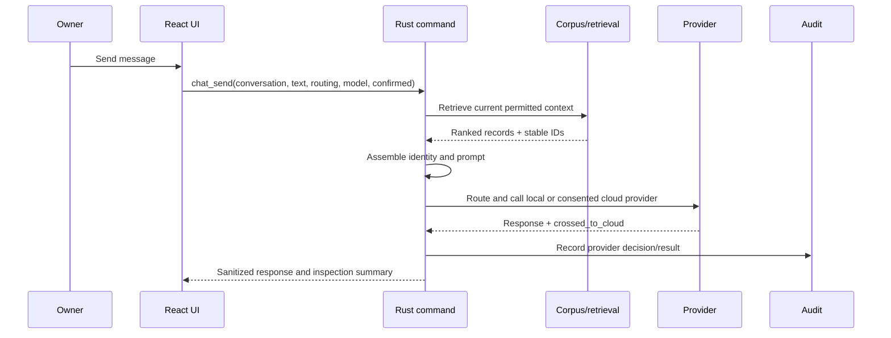

# Data flow

[Architecture overview](overview.md) · [Provider architecture](provider-architecture.md)

The UI supplies intent and confirmation; it does not decide what private records
may cross the provider boundary. The backend filters, routes, and audits.
