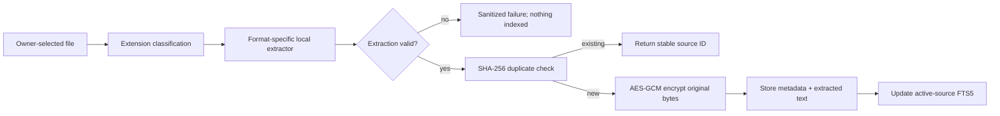

# Ingestion pipeline

[Document guide](../user-guide/document-ingestion.md) · [Security boundaries](security-boundaries.md)

PDF and DOCX parsers operate locally. DOCX extraction reads only the document XML.
Image OCR streams bytes into a local Tesseract process. Untrusted content becomes
data for retrieval; it is not treated as an instruction to Sammy’s application
runtime and does not execute embedded code.
