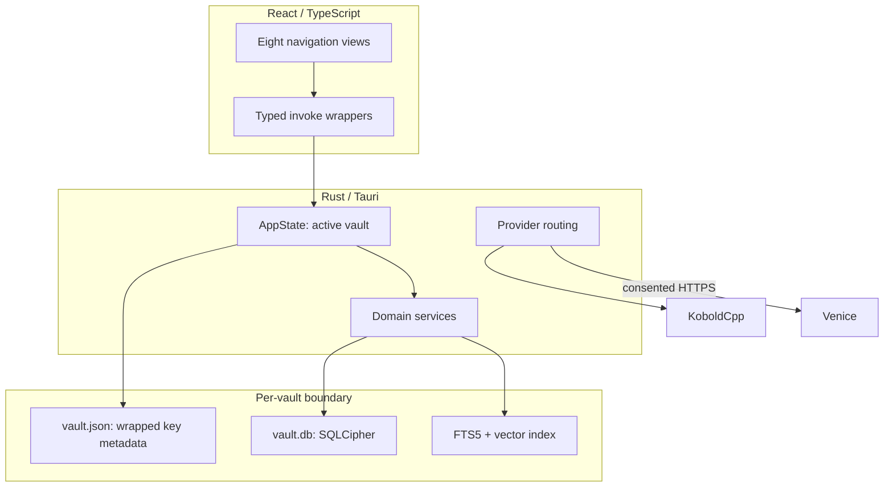

# Architecture overview

[Documentation home](../README.md) · [Repository layout](../development/repository-layout.md) · [Security boundaries](security-boundaries.md)

Sammy is a Tauri 2 desktop application. React renders the interface and invokes a
typed command surface. Rust owns private state, cryptography, storage, provider
calls, retrieval, and audit decisions.

`AppState` holds at most one unlocked `Vault`; dropping it closes the database
connection and zeroizing secret-key object. Commands return sanitized DTOs, not
connections or key material. Forward-only transactional migrations evolve each
vault independently.
