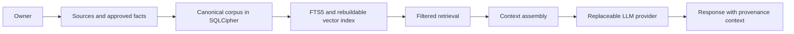

# Personal Knowledge Corpus

[Documentation home](../README.md) · [Provenance](provenance.md) · [Corpus architecture](../architecture/corpus-architecture.md)

The Personal Knowledge Corpus is the durable, owner-controlled knowledge layer
that gives Sammy continuity across models. It combines structured records,
encrypted sources, provenance, reviewed memory, conversation history, and audit
history inside a vault.

The model is not the authoritative memory store. Corpus records have stable IDs,
states, sensitivity, source references, and history. Models receive only the
context selected for a turn. Switching providers leaves canonical records intact.

Facts can be corrected through supersession, disputed through contradiction
state, or removed from current retrieval through tombstones. Vector embeddings
are deterministic derived data: useful for matching, but disposable and
rebuildable from current canonical records.
