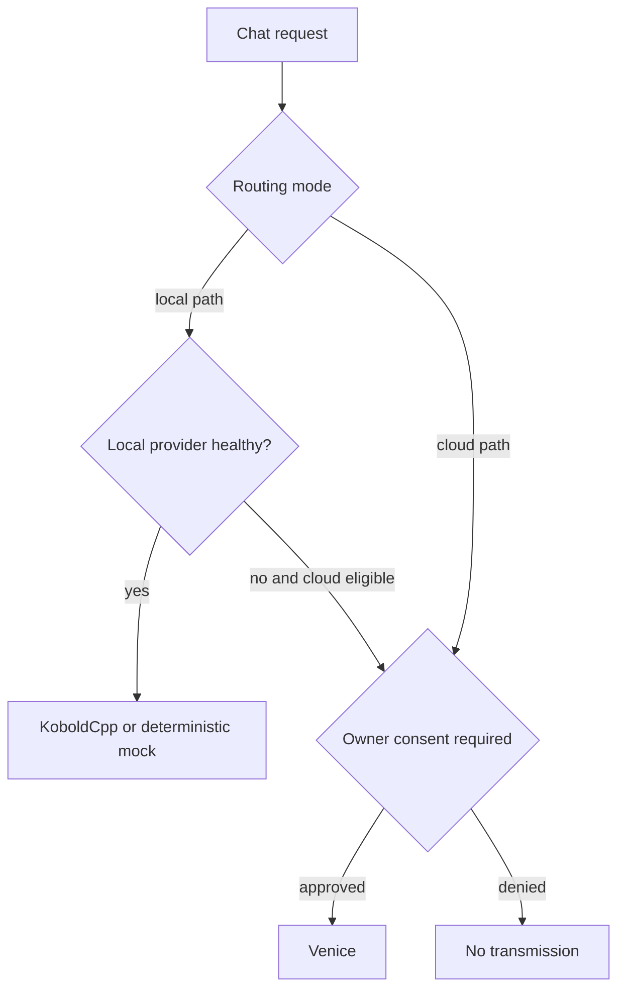

# Providers and routing

[KoboldCpp](../getting-started/koboldcpp.md) · [Provider architecture](../architecture/provider-architecture.md) · [Privacy](privacy-controls.md)

Sammy ships deterministic Mock, local KoboldCpp-compatible, and cloud Venice
adapters behind one backend provider interface. Provider changes do not migrate
or rewrite identity, messages, or corpus records.

| Mode | Behavior |
| --- | --- |
| `local_only` | Use an available local provider or fail closed |
| `cloud_only` | Select cloud and require the applicable cloud consent |
| `prefer_local` | Prefer local; cloud requires consent when considered |
| `prefer_cloud` | Prefer cloud with consent |
| `ask_before_crossing` | Use healthy local service; ask before any cloud crossing |

Every provider result states whether it crossed to cloud. Cloud transmission and
denial are audited. Errors distinguish connection, timeout, authentication,
rate-limit, decoding, and server classes without logging request bodies.
